# Imdb_Scraping_Analysis
<br>
<br>
## For the jupyter notebook go to IMDB / Imdb_Scraping_Analysis.ipynb
<br>
<br>
<br>

# WEB SCRAPING AND DATA ANALYSIS OF IMDB TOP 1000 MOVIES FROM 1921 TO 2021


## Python Library Used
  - selenium webdriver
  - pandas
  - numpy
  - matplotlib
  - seaborn 
  - tabulate


# DATA ANALYSIS


# INTRODUCTORY ANALYSIS OF DATASET


```python
df_imdb.sort_values('year').head()
```


<div>

<table border="1" class="dataframe">
  <thead>
    <tr style="text-align: right;">
      <th></th>
      <th>movie-name</th>
      <th>year</th>
      <th>duration(min)</th>
      <th>genre</th>
      <th>rating</th>
      <th>overview</th>
      <th>director</th>
      <th>image_url</th>
      <th>votes</th>
    </tr>
  </thead>
  <tbody>
    <tr>
      <th>335</th>
      <td>The Cabinet of Dr. Caligari</td>
      <td>1920</td>
      <td>67</td>
      <td>Fantasy, Horror, Mystery</td>
      <td>8.1</td>
      <td>Hypnotist Dr. Caligari uses a somnambulist, Ce...</td>
      <td>Robert Wiene</td>
      <td>https://m.media-amazon.com/images/S/sash/4Fyxw...</td>
      <td>59336</td>
    </tr>
    <tr>
      <th>133</th>
      <td>The Kid</td>
      <td>1921</td>
      <td>68</td>
      <td>Comedy, Drama, Family</td>
      <td>8.3</td>
      <td>The Tramp cares for an abandoned child, but ev...</td>
      <td>Charles Chaplin</td>
      <td>https://m.media-amazon.com/images/S/sash/4Fyxw...</td>
      <td>117964</td>
    </tr>
    <tr>
      <th>581</th>
      <td>Nosferatu</td>
      <td>1922</td>
      <td>94</td>
      <td>Fantasy, Horror</td>
      <td>7.9</td>
      <td>Vampire Count Orlok expresses interest in a ne...</td>
      <td>F.W. Murnau</td>
      <td>https://m.media-amazon.com/images/S/sash/4Fyxw...</td>
      <td>91106</td>
    </tr>
    <tr>
      <th>198</th>
      <td>Sherlock Jr.</td>
      <td>1924</td>
      <td>45</td>
      <td>Action, Comedy, Romance</td>
      <td>8.2</td>
      <td>A film projectionist longs to be a detective, ...</td>
      <td>Buster Keaton</td>
      <td>https://m.media-amazon.com/images/S/sash/4Fyxw...</td>
      <td>44584</td>
    </tr>
    <tr>
      <th>197</th>
      <td>The Gold Rush</td>
      <td>1925</td>
      <td>95</td>
      <td>Adventure, Comedy, Drama</td>
      <td>8.2</td>
      <td>A prospector goes to the Klondike in search of...</td>
      <td>Charles Chaplin</td>
      <td>https://m.media-amazon.com/images/S/sash/4Fyxw...</td>
      <td>104631</td>
    </tr>
  </tbody>
</table>
</div>


```python
df_imdb.sort_values('year').tail()
```


<div>

<table border="1" class="dataframe">
  <thead>
    <tr style="text-align: right;">
      <th></th>
      <th>movie-name</th>
      <th>year</th>
      <th>duration(min)</th>
      <th>genre</th>
      <th>rating</th>
      <th>overview</th>
      <th>director</th>
      <th>image_url</th>
      <th>votes</th>
    </tr>
  </thead>
  <tbody>
    <tr>
      <th>209</th>
      <td>Soul</td>
      <td>2020</td>
      <td>100</td>
      <td>Animation, Adventure, Comedy</td>
      <td>8.1</td>
      <td>After landing the gig of a lifetime, a New Yor...</td>
      <td>Pete Docter</td>
      <td>https://m.media-amazon.com/images/S/sash/4Fyxw...</td>
      <td>266085</td>
    </tr>
    <tr>
      <th>95</th>
      <td>Demon Slayer: Mugen Train</td>
      <td>2020</td>
      <td>117</td>
      <td>Animation, Action, Adventure</td>
      <td>8.3</td>
      <td>After his family was brutally murdered and his...</td>
      <td>Haruo Sotozaki</td>
      <td>https://m.media-amazon.com/images/S/sash/4Fyxw...</td>
      <td>30294</td>
    </tr>
    <tr>
      <th>229</th>
      <td>Zack Snyder's Justice League</td>
      <td>2021</td>
      <td>242</td>
      <td>Action, Adventure, Fantasy</td>
      <td>8.1</td>
      <td>Determined to ensure Superman's ultimate sacri...</td>
      <td>Zack Snyder</td>
      <td>https://m.media-amazon.com/images/S/sash/4Fyxw...</td>
      <td>318072</td>
    </tr>
    <tr>
      <th>21</th>
      <td>Drishyam 2</td>
      <td>2021</td>
      <td>152</td>
      <td>Crime, Drama, Thriller</td>
      <td>8.6</td>
      <td>A gripping tale of an investigation and a fami...</td>
      <td>Jeethu Joseph</td>
      <td>https://m.media-amazon.com/images/S/sash/4Fyxw...</td>
      <td>29181</td>
    </tr>
    <tr>
      <th>728</th>
      <td>The Mitchells vs the Machines</td>
      <td>2021</td>
      <td>113</td>
      <td>Animation, Adventure, Comedy</td>
      <td>7.7</td>
      <td>A quirky, dysfunctional family's road trip is ...</td>
      <td>Michael Rianda</td>
      <td>https://m.media-amazon.com/images/S/sash/4Fyxw...</td>
      <td>69005</td>
    </tr>
  </tbody>
</table>
</div>


```python
def path_to_image_html(path):
    return ''
df_imdb.to_html(escape=False, formatters=dict(image_url=path_to_image_html))
HTML(df_imdb.head(3).to_html(escape=False,formatters=dict(image_url=path_to_image_html)))

```


<table border="1" class="dataframe">
  <thead>
    <tr style="text-align: right;">
      <th></th>
      <th>movie-name</th>
      <th>year</th>
      <th>duration(min)</th>
      <th>genre</th>
      <th>rating</th>
      <th>overview</th>
      <th>director</th>
      <th>image_url</th>
      <th>votes</th>
    </tr>
  </thead>
  <tbody>
    <tr>
      <th>0</th>
      <td>The Shawshank Redemption</td>
      <td>1994</td>
      <td>142</td>
      <td>Drama</td>
      <td>9.3</td>
      <td>Two imprisoned men bond over a number of years, finding solace and eventual redemption through acts of common decency.</td>
      <td>Frank Darabont</td>
      <td></td>
      <td>2429850</td>
    </tr>
    <tr>
      <th>1</th>
      <td>The Godfather</td>
      <td>1972</td>
      <td>175</td>
      <td>Crime, Drama</td>
      <td>9.2</td>
      <td>An organized crime dynasty's aging patriarch transfers control of his clandestine empire to his reluctant son.</td>
      <td>Francis Ford Coppola</td>
      <td></td>
      <td>1682074</td>
    </tr>
    <tr>
      <th>2</th>
      <td>Soorarai Pottru</td>
      <td>2020</td>
      <td>153</td>
      <td>Drama</td>
      <td>9.1</td>
      <td>Nedumaaran Rajangam "Maara" sets out to make the common man fly and in the process takes on the world's most capital intensive industry and several enemies who stand in his way.</td>
      <td>Sudha Kongara</td>
      <td></td>
      <td>85875</td>
    </tr>
  </tbody>
</table>


```python
df_imdb.info()
```

     #   Column         Non-Null Count  Dtype  
    ---  ------         --------------  -----  
     0   movie-name     1000 non-null   object 
     1   year           1000 non-null   int64  
     2   duration(min)  1000 non-null   int64  
     3   genre          1000 non-null   object 
     4   rating         1000 non-null   float64
     5   overview       1000 non-null   object 
     6   director       1000 non-null   object 
     7   image_url      1000 non-null   object 
     8   votes          1000 non-null   int64  


```python
df_imdb.describe()
```


<div>

<table border="1" class="dataframe">
  <thead>
    <tr style="text-align: right;">
      <th></th>
      <th>year</th>
      <th>duration(min)</th>
      <th>rating</th>
      <th>votes</th>
    </tr>
  </thead>
  <tbody>
    <tr>
      <th>count</th>
      <td>1000.00000</td>
      <td>1000.000000</td>
      <td>1000.000000</td>
      <td>1.000000e+03</td>
    </tr>
    <tr>
      <th>mean</th>
      <td>1991.29200</td>
      <td>123.091000</td>
      <td>7.958000</td>
      <td>2.818462e+05</td>
    </tr>
    <tr>
      <th>std</th>
      <td>23.48319</td>
      <td>28.195668</td>
      <td>0.277837</td>
      <td>3.388020e+05</td>
    </tr>
    <tr>
      <th>min</th>
      <td>1920.00000</td>
      <td>45.000000</td>
      <td>7.600000</td>
      <td>2.517400e+04</td>
    </tr>
    <tr>
      <th>25%</th>
      <td>1976.00000</td>
      <td>103.000000</td>
      <td>7.700000</td>
      <td>5.609275e+04</td>
    </tr>
    <tr>
      <th>50%</th>
      <td>1999.00000</td>
      <td>119.000000</td>
      <td>7.900000</td>
      <td>1.391525e+05</td>
    </tr>
    <tr>
      <th>75%</th>
      <td>2010.00000</td>
      <td>137.000000</td>
      <td>8.100000</td>
      <td>3.862468e+05</td>
    </tr>
    <tr>
      <th>max</th>
      <td>2021.00000</td>
      <td>321.000000</td>
      <td>9.300000</td>
      <td>2.429850e+06</td>
    </tr>
  </tbody>
</table>
</div>


```python

```

# Insights 

- Dataset contains movies from year 1920 to 2021  
- The dataset contain 1000 movie with 9 columns of details.
- The maximum duration of movie is 321 minutes and minimum duration is 45 minutes.
- Maximum rating is 9.3 and minimum rating is 7.6


```python

```


# YEAR ANALYSIS


### graph of year and number of movies

    
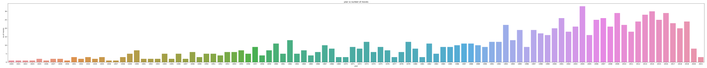
    


##  graph of number of movie vs year


## First 10 Year Graph


    

    


## LAST 10 YEARS DATA  


```python

```


    
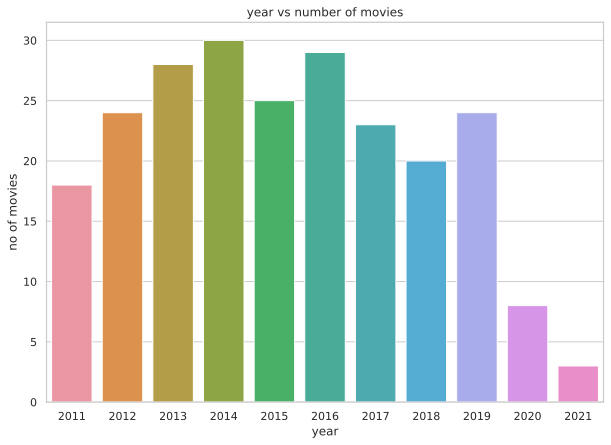
    


```python

```

# top 10 years with the most number of movie released


    2004    33
    2014    30
    2009    29
    2016    29
    2013    28
    2007    26
    2001    26
    2015    25
    2006    25
    2019    24


    
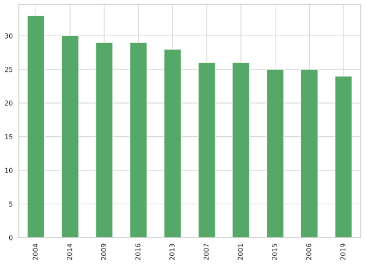
    


```python

```

## MOVIES LIST OF THE YEAR HAVING THE MOST NUMBER OF MOVIES i.e 2004


    2004    33
    


<div>

<table border="1" class="dataframe">
  <thead>
    <tr style="text-align: right;">
      <th></th>
      <th>movie-name</th>
      <th>year</th>
      <th>duration(min)</th>
      <th>genre</th>
      <th>rating</th>
      <th>overview</th>
      <th>director</th>
      <th>image_url</th>
      <th>votes</th>
    </tr>
  </thead>
  <tbody>
    <tr>
      <th>99</th>
      <td>Eternal Sunshine of the Spotless Mind</td>
      <td>2004</td>
      <td>108</td>
      <td>Drama, Romance, Sci-Fi</td>
      <td>8.3</td>
      <td>When their relationship turns sour, a couple u...</td>
      <td>Michel Gondry</td>
      <td>https://m.media-amazon.com/images/S/sash/4Fyxw...</td>
      <td>938481</td>
    </tr>
    <tr>
      <th>162</th>
      <td>Swades</td>
      <td>2004</td>
      <td>189</td>
      <td>Drama</td>
      <td>8.2</td>
      <td>A successful Indian scientist returns to an In...</td>
      <td>Ashutosh Gowariker</td>
      <td>https://m.media-amazon.com/images/S/sash/4Fyxw...</td>
      <td>85959</td>
    </tr>
    <tr>
      <th>163</th>
      <td>Downfall</td>
      <td>2004</td>
      <td>156</td>
      <td>Biography, Drama, History</td>
      <td>8.2</td>
      <td>Traudl Junge, the final secretary for Adolf Hi...</td>
      <td>Oliver Hirschbiegel</td>
      <td>https://m.media-amazon.com/images/S/sash/4Fyxw...</td>
      <td>338767</td>
    </tr>
    <tr>
      <th>164</th>
      <td>Howl's Moving Castle</td>
      <td>2004</td>
      <td>119</td>
      <td>Animation, Adventure, Family</td>
      <td>8.2</td>
      <td>When an unconfident young woman is cursed with...</td>
      <td>Hayao Miyazaki</td>
      <td>https://m.media-amazon.com/images/S/sash/4Fyxw...</td>
      <td>351077</td>
    </tr>
    <tr>
      <th>239</th>
      <td>Nobody Knows</td>
      <td>2004</td>
      <td>141</td>
      <td>Drama</td>
      <td>8.1</td>
      <td>In a small Tokyo apartment, twelve-year-old Ak...</td>
      <td>Hirokazu Koreeda</td>
      <td>https://m.media-amazon.com/images/S/sash/4Fyxw...</td>
      <td>25932</td>
    </tr>
    <tr>
      <th>241</th>
      <td>Million Dollar Baby</td>
      <td>2004</td>
      <td>132</td>
      <td>Drama, Sport</td>
      <td>8.1</td>
      <td>A determined woman works with a hardened boxin...</td>
      <td>Clint Eastwood</td>
      <td>https://m.media-amazon.com/images/S/sash/4Fyxw...</td>
      <td>651722</td>
    </tr>
    <tr>
      <th>242</th>
      <td>Hotel Rwanda</td>
      <td>2004</td>
      <td>121</td>
      <td>Biography, Drama, History</td>
      <td>8.1</td>
      <td>Paul Rusesabagina, a hotel manager, houses ove...</td>
      <td>Terry George</td>
      <td>https://m.media-amazon.com/images/S/sash/4Fyxw...</td>
      <td>340985</td>
    </tr>
    <tr>
      <th>243</th>
      <td>Before Sunset</td>
      <td>2004</td>
      <td>80</td>
      <td>Drama, Romance</td>
      <td>8.1</td>
      <td>Nine years after Jesse and Celine first met, t...</td>
      <td>Richard Linklater</td>
      <td>https://m.media-amazon.com/images/S/sash/4Fyxw...</td>
      <td>244848</td>
    </tr>
    <tr>
      <th>377</th>
      <td>3-Iron</td>
      <td>2004</td>
      <td>88</td>
      <td>Crime, Drama, Romance</td>
      <td>8.0</td>
      <td>A transient young man breaks into empty homes ...</td>
      <td>Kim Ki-duk</td>
      <td>https://m.media-amazon.com/images/S/sash/4Fyxw...</td>
      <td>52374</td>
    </tr>
    <tr>
      <th>380</th>
      <td>Tae Guk Gi: The Brotherhood of War</td>
      <td>2004</td>
      <td>140</td>
      <td>Action, Drama, War</td>
      <td>8.0</td>
      <td>When two brothers are forced to fight in the K...</td>
      <td>Je-kyu Kang</td>
      <td>https://m.media-amazon.com/images/S/sash/4Fyxw...</td>
      <td>38479</td>
    </tr>
    <tr>
      <th>381</th>
      <td>G.O.R.A.</td>
      <td>2004</td>
      <td>127</td>
      <td>Adventure, Comedy, Sci-Fi</td>
      <td>8.0</td>
      <td>A slick young Turk kidnapped by extraterrestri...</td>
      <td>Ömer Faruk Sorak</td>
      <td>https://m.media-amazon.com/images/S/sash/4Fyxw...</td>
      <td>59047</td>
    </tr>
    <tr>
      <th>384</th>
      <td>Kill Bill: Vol. 2</td>
      <td>2004</td>
      <td>137</td>
      <td>Action, Crime, Thriller</td>
      <td>8.0</td>
      <td>The Bride continues her quest of vengeance aga...</td>
      <td>Quentin Tarantino</td>
      <td>https://m.media-amazon.com/images/S/sash/4Fyxw...</td>
      <td>705390</td>
    </tr>
    <tr>
      <th>387</th>
      <td>The Sea Inside</td>
      <td>2004</td>
      <td>126</td>
      <td>Biography, Drama</td>
      <td>8.0</td>
      <td>The factual story of Spaniard Ramon Sampedro, ...</td>
      <td>Alejandro Amenábar</td>
      <td>https://m.media-amazon.com/images/S/sash/4Fyxw...</td>
      <td>79087</td>
    </tr>
    <tr>
      <th>392</th>
      <td>The Incredibles</td>
      <td>2004</td>
      <td>115</td>
      <td>Animation, Action, Adventure</td>
      <td>8.0</td>
      <td>A family of undercover superheroes, while tryi...</td>
      <td>Brad Bird</td>
      <td>https://m.media-amazon.com/images/S/sash/4Fyxw...</td>
      <td>674445</td>
    </tr>
    <tr>
      <th>511</th>
      <td>The Chorus</td>
      <td>2004</td>
      <td>97</td>
      <td>Comedy, Drama, Music</td>
      <td>7.9</td>
      <td>The new teacher at a severely administered boy...</td>
      <td>Christophe Barratier</td>
      <td>https://m.media-amazon.com/images/S/sash/4Fyxw...</td>
      <td>58972</td>
    </tr>
    <tr>
      <th>513</th>
      <td>Shaun of the Dead</td>
      <td>2004</td>
      <td>99</td>
      <td>Comedy, Horror</td>
      <td>7.9</td>
      <td>A man's uneventful life is disrupted by the zo...</td>
      <td>Edgar Wright</td>
      <td>https://m.media-amazon.com/images/S/sash/4Fyxw...</td>
      <td>525912</td>
    </tr>
    <tr>
      <th>515</th>
      <td>Head-On</td>
      <td>2004</td>
      <td>121</td>
      <td>Drama, Romance</td>
      <td>7.9</td>
      <td>With the intention to break free from the stri...</td>
      <td>Fatih Akin</td>
      <td>https://m.media-amazon.com/images/S/sash/4Fyxw...</td>
      <td>52341</td>
    </tr>
    <tr>
      <th>517</th>
      <td>Harry Potter and the Prisoner of Azkaban</td>
      <td>2004</td>
      <td>142</td>
      <td>Adventure, Family, Fantasy</td>
      <td>7.9</td>
      <td>Harry Potter, Ron and Hermione return to Hogwa...</td>
      <td>Alfonso Cuarón</td>
      <td>https://m.media-amazon.com/images/S/sash/4Fyxw...</td>
      <td>572975</td>
    </tr>
    <tr>
      <th>643</th>
      <td>Veer-Zaara</td>
      <td>2004</td>
      <td>192</td>
      <td>Drama, Family, Musical</td>
      <td>7.8</td>
      <td>Veer-Zaara is a saga of love, separation, cour...</td>
      <td>Yash Chopra</td>
      <td>https://m.media-amazon.com/images/S/sash/4Fyxw...</td>
      <td>50474</td>
    </tr>
    <tr>
      <th>651</th>
      <td>The Notebook</td>
      <td>2004</td>
      <td>123</td>
      <td>Drama, Romance</td>
      <td>7.8</td>
      <td>A poor yet passionate young man falls in love ...</td>
      <td>Nick Cassavetes</td>
      <td>https://m.media-amazon.com/images/S/sash/4Fyxw...</td>
      <td>535361</td>
    </tr>
    <tr>
      <th>652</th>
      <td>The Motorcycle Diaries</td>
      <td>2004</td>
      <td>126</td>
      <td>Adventure, Biography, Drama</td>
      <td>7.8</td>
      <td>The dramatization of a motorcycle road trip Ch...</td>
      <td>Walter Salles</td>
      <td>https://m.media-amazon.com/images/S/sash/4Fyxw...</td>
      <td>98531</td>
    </tr>
    <tr>
      <th>787</th>
      <td>Crash</td>
      <td>2004</td>
      <td>112</td>
      <td>Crime, Drama, Thriller</td>
      <td>7.7</td>
      <td>Los Angeles citizens with vastly separate live...</td>
      <td>Paul Haggis</td>
      <td>https://m.media-amazon.com/images/S/sash/4Fyxw...</td>
      <td>425135</td>
    </tr>
    <tr>
      <th>788</th>
      <td>Kung Fu Hustle</td>
      <td>2004</td>
      <td>99</td>
      <td>Action, Comedy, Fantasy</td>
      <td>7.7</td>
      <td>In Shanghai, China in the 1940s, a wannabe gan...</td>
      <td>Stephen Chow</td>
      <td>https://m.media-amazon.com/images/S/sash/4Fyxw...</td>
      <td>130942</td>
    </tr>
    <tr>
      <th>789</th>
      <td>The Bourne Supremacy</td>
      <td>2004</td>
      <td>108</td>
      <td>Action, Mystery, Thriller</td>
      <td>7.7</td>
      <td>When Jason Bourne is framed for a CIA operatio...</td>
      <td>Paul Greengrass</td>
      <td>https://m.media-amazon.com/images/S/sash/4Fyxw...</td>
      <td>443409</td>
    </tr>
    <tr>
      <th>790</th>
      <td>The Machinist</td>
      <td>2004</td>
      <td>101</td>
      <td>Drama, Thriller</td>
      <td>7.7</td>
      <td>An industrial worker who hasn't slept in a yea...</td>
      <td>Brad Anderson</td>
      <td>https://m.media-amazon.com/images/S/sash/4Fyxw...</td>
      <td>366983</td>
    </tr>
    <tr>
      <th>791</th>
      <td>Ray</td>
      <td>2004</td>
      <td>152</td>
      <td>Biography, Drama, Music</td>
      <td>7.7</td>
      <td>The story of the life and career of the legend...</td>
      <td>Taylor Hackford</td>
      <td>https://m.media-amazon.com/images/S/sash/4Fyxw...</td>
      <td>141612</td>
    </tr>
    <tr>
      <th>794</th>
      <td>Man on Fire</td>
      <td>2004</td>
      <td>146</td>
      <td>Action, Crime, Drama</td>
      <td>7.7</td>
      <td>In Mexico City, a former CIA operative swears ...</td>
      <td>Tony Scott</td>
      <td>https://m.media-amazon.com/images/S/sash/4Fyxw...</td>
      <td>337144</td>
    </tr>
    <tr>
      <th>798</th>
      <td>Finding Neverland</td>
      <td>2004</td>
      <td>106</td>
      <td>Biography, Drama, Family</td>
      <td>7.7</td>
      <td>The story of Sir J.M. Barrie's friendship with...</td>
      <td>Marc Forster</td>
      <td>https://m.media-amazon.com/images/S/sash/4Fyxw...</td>
      <td>201403</td>
    </tr>
    <tr>
      <th>938</th>
      <td>Dead Man's Shoes</td>
      <td>2004</td>
      <td>90</td>
      <td>Crime, Drama, Thriller</td>
      <td>7.6</td>
      <td>A disaffected soldier returns to his hometown ...</td>
      <td>Shane Meadows</td>
      <td>https://m.media-amazon.com/images/S/sash/4Fyxw...</td>
      <td>51002</td>
    </tr>
    <tr>
      <th>943</th>
      <td>Saw</td>
      <td>2004</td>
      <td>103</td>
      <td>Horror, Mystery, Thriller</td>
      <td>7.6</td>
      <td>Two strangers awaken in a room with no recolle...</td>
      <td>James Wan</td>
      <td>https://m.media-amazon.com/images/S/sash/4Fyxw...</td>
      <td>392360</td>
    </tr>
    <tr>
      <th>944</th>
      <td>Mysterious Skin</td>
      <td>2004</td>
      <td>105</td>
      <td>Drama</td>
      <td>7.6</td>
      <td>A teenage hustler and a young man obsessed wit...</td>
      <td>Gregg Araki</td>
      <td>https://m.media-amazon.com/images/S/sash/4Fyxw...</td>
      <td>67029</td>
    </tr>
    <tr>
      <th>945</th>
      <td>A Very Long Engagement</td>
      <td>2004</td>
      <td>133</td>
      <td>Drama, Mystery, Romance</td>
      <td>7.6</td>
      <td>Tells the story of a young woman's relentless ...</td>
      <td>Jean-Pierre Jeunet</td>
      <td>https://m.media-amazon.com/images/S/sash/4Fyxw...</td>
      <td>71874</td>
    </tr>
    <tr>
      <th>950</th>
      <td>The Butterfly Effect</td>
      <td>2004</td>
      <td>113</td>
      <td>Drama, Sci-Fi, Thriller</td>
      <td>7.6</td>
      <td>Evan Treborn suffers blackouts during signific...</td>
      <td>Eric Bress</td>
      <td>https://m.media-amazon.com/images/S/sash/4Fyxw...</td>
      <td>462667</td>
    </tr>
  </tbody>
</table>
</div>


## Movies with  maximum and minimum rating in 2004

<br>

### Maximum rating

    8.3


<div>

<table border="1" class="dataframe">
  <thead>
    <tr style="text-align: right;">
      <th></th>
      <th>movie-name</th>
      <th>year</th>
      <th>duration(min)</th>
      <th>genre</th>
      <th>rating</th>
      <th>director</th>
      <th>votes</th>
    </tr>
  </thead>
  <tbody>
    <tr>
      <th>99</th>
      <td>Eternal Sunshine of the Spotless Mind</td>
      <td>2004</td>
      <td>108</td>
      <td>Drama, Romance, Sci-Fi</td>
      <td>8.3</td>
      <td>Michel Gondry</td>
      <td>938481</td>
    </tr>
  </tbody>
</table>
</div>


```python
Minimum rating : 7.6
```

      movies with minimum rating : 
      - Dead Man's Shoes
      - Saw
      - Mysterious Skin
      - A Very Long Engagement
      - The Butterfly Effect


### Movies with maximum votes in 2004


    max votes : 938481


<div>

<table border="1" class="dataframe">
  <thead>
    <tr style="text-align: right;">
      <th></th>
      <th>movie-name</th>
      <th>year</th>
      <th>duration(min)</th>
      <th>genre</th>
      <th>rating</th>
      <th>director</th>
      <th>votes</th>
    </tr>
  </thead>
  <tbody>
    <tr>
      <th>99</th>
      <td>Eternal Sunshine of the Spotless Mind</td>
      <td>2004</td>
      <td>108</td>
      <td>Drama, Romance, Sci-Fi</td>
      <td>8.3</td>
      <td>Michel Gondry</td>
      <td>938481</td>
    </tr>
  </tbody>
</table>
</div>


## Genre check


```
    genre with number of movies : 
```


    Drama, Romance                  3
    Drama                           3
    Crime, Drama, Thriller          2
    Biography, Drama, History       2
    Biography, Drama, Family        1
    Comedy, Horror                  1
    Action, Drama, War              1
    Drama, Romance, Sci-Fi          1
    Horror, Mystery, Thriller       1
    Adventure, Biography, Drama     1
    Animation, Action, Adventure    1
    Adventure, Family, Fantasy      1
    Biography, Drama                1
    Drama, Family, Musical          1
    Action, Comedy, Fantasy         1
    Drama, Sci-Fi, Thriller         1
    Drama, Mystery, Romance         1
    Action, Mystery, Thriller       1
    Comedy, Drama, Music            1
    Drama, Thriller                 1
    Drama, Sport                    1
    Adventure, Comedy, Sci-Fi       1
    Action, Crime, Thriller         1
    Biography, Drama, Music         1
    Animation, Adventure, Family    1
    Action, Crime, Drama            1
    Crime, Drama, Romance           1
    Name: genre, dtype: int64


```python

```

# Movies in 2004 with graph


<div>

<table border="1" class="dataframe">
  <thead>
    <tr style="text-align: right;">
      <th></th>
      <th>movie_name of 2004</th>
      <th>duration</th>
    </tr>
  </thead>
  <tbody>
    <tr>
      <th>99</th>
      <td>Eternal Sunshine of the Spotless Mind</td>
      <td>108</td>
    </tr>
    <tr>
      <th>162</th>
      <td>Swades</td>
      <td>189</td>
    </tr>
    <tr>
      <th>163</th>
      <td>Downfall</td>
      <td>156</td>
    </tr>
    <tr>
      <th>164</th>
      <td>Howl's Moving Castle</td>
      <td>119</td>
    </tr>
    <tr>
      <th>239</th>
      <td>Nobody Knows</td>
      <td>141</td>
    </tr>
    <tr>
      <th>241</th>
      <td>Million Dollar Baby</td>
      <td>132</td>
    </tr>
    <tr>
      <th>242</th>
      <td>Hotel Rwanda</td>
      <td>121</td>
    </tr>
    <tr>
      <th>243</th>
      <td>Before Sunset</td>
      <td>80</td>
    </tr>
    <tr>
      <th>377</th>
      <td>3-Iron</td>
      <td>88</td>
    </tr>
    <tr>
      <th>380</th>
      <td>Tae Guk Gi: The Brotherhood of War</td>
      <td>140</td>
    </tr>
    <tr>
      <th>381</th>
      <td>G.O.R.A.</td>
      <td>127</td>
    </tr>
    <tr>
      <th>384</th>
      <td>Kill Bill: Vol. 2</td>
      <td>137</td>
    </tr>
    <tr>
      <th>387</th>
      <td>The Sea Inside</td>
      <td>126</td>
    </tr>
    <tr>
      <th>392</th>
      <td>The Incredibles</td>
      <td>115</td>
    </tr>
    <tr>
      <th>511</th>
      <td>The Chorus</td>
      <td>97</td>
    </tr>
    <tr>
      <th>513</th>
      <td>Shaun of the Dead</td>
      <td>99</td>
    </tr>
    <tr>
      <th>515</th>
      <td>Head-On</td>
      <td>121</td>
    </tr>
    <tr>
      <th>517</th>
      <td>Harry Potter and the Prisoner of Azkaban</td>
      <td>142</td>
    </tr>
    <tr>
      <th>643</th>
      <td>Veer-Zaara</td>
      <td>192</td>
    </tr>
    <tr>
      <th>651</th>
      <td>The Notebook</td>
      <td>123</td>
    </tr>
    <tr>
      <th>652</th>
      <td>The Motorcycle Diaries</td>
      <td>126</td>
    </tr>
    <tr>
      <th>787</th>
      <td>Crash</td>
      <td>112</td>
    </tr>
    <tr>
      <th>788</th>
      <td>Kung Fu Hustle</td>
      <td>99</td>
    </tr>
    <tr>
      <th>789</th>
      <td>The Bourne Supremacy</td>
      <td>108</td>
    </tr>
    <tr>
      <th>790</th>
      <td>The Machinist</td>
      <td>101</td>
    </tr>
    <tr>
      <th>791</th>
      <td>Ray</td>
      <td>152</td>
    </tr>
    <tr>
      <th>794</th>
      <td>Man on Fire</td>
      <td>146</td>
    </tr>
    <tr>
      <th>798</th>
      <td>Finding Neverland</td>
      <td>106</td>
    </tr>
    <tr>
      <th>938</th>
      <td>Dead Man's Shoes</td>
      <td>90</td>
    </tr>
    <tr>
      <th>943</th>
      <td>Saw</td>
      <td>103</td>
    </tr>
    <tr>
      <th>944</th>
      <td>Mysterious Skin</td>
      <td>105</td>
    </tr>
    <tr>
      <th>945</th>
      <td>A Very Long Engagement</td>
      <td>133</td>
    </tr>
    <tr>
      <th>950</th>
      <td>The Butterfly Effect</td>
      <td>113</td>
    </tr>
  </tbody>
</table>
</div>


```python

```


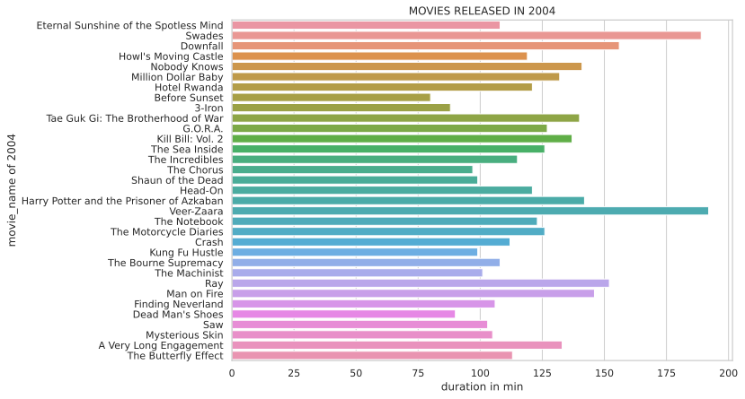
    


```python

```


# Information after analysising Year column

- In the first ten years of the dataset i.e from 1920 to 1930 , maximum 2 movies released in each  1925 , 1927 , 1928 

- In the last 10 years maximum movies released is 31 . 
So more movies were released with time with the advancement of technology .

- 3.1 percent of the movies released in 2014.
- 31 movies has been released in 2014. 
- 2004 is the year with the most number of movies released-33 movies , followed by year 2014 with 31 movies and 29 movies in the year 2009.

### Now talking about the movies releasd in 2004  : 
- movie with highest rating  : Eternal Sunshine of the Spotless Mind (8.3 /10)

- movie with maximum votes : Eternal Sunshine of the Spotless Mind (938481)

- Most of the movies released in 2004 have genre DRAMA 

- Five movies got the lowest rating in 2004 , the movies are :
     - Dead Man's Shoes
     - Saw
     - Mysterious Skin
     - A Very Long Engagement 
     - The Butterfly Effect


```python

```

# DURATION ANALYSIS


```python

```

## DURATION VS NUMBER OF MOVIES first 5  


<div>

<table border="1" class="dataframe">
  <thead>
    <tr style="text-align: right;">
      <th></th>
      <th>duration in min</th>
      <th>no of movies</th>
    </tr>
  </thead>
  <tbody>
    <tr>
      <th>0</th>
      <td>130</td>
      <td>23</td>
    </tr>
    <tr>
      <th>1</th>
      <td>129</td>
      <td>22</td>
    </tr>
    <tr>
      <th>2</th>
      <td>100</td>
      <td>22</td>
    </tr>
    <tr>
      <th>3</th>
      <td>101</td>
      <td>21</td>
    </tr>
    <tr>
      <th>4</th>
      <td>113</td>
      <td>21</td>
    </tr>
  </tbody>
</table>
</div>


```
duration with number of movies of top 10 duration
```


<div>

<table border="1" class="dataframe">
  <thead>
    <tr style="text-align: right;">
      <th></th>
      <th>duration in min</th>
      <th>no of movies</th>
    </tr>
  </thead>
  <tbody>
    <tr>
      <th>0</th>
      <td>130</td>
      <td>23</td>
    </tr>
    <tr>
      <th>2</th>
      <td>100</td>
      <td>22</td>
    </tr>
    <tr>
      <th>1</th>
      <td>129</td>
      <td>22</td>
    </tr>
    <tr>
      <th>3</th>
      <td>101</td>
      <td>21</td>
    </tr>
    <tr>
      <th>4</th>
      <td>113</td>
      <td>21</td>
    </tr>
    <tr>
      <th>5</th>
      <td>102</td>
      <td>20</td>
    </tr>
    <tr>
      <th>6</th>
      <td>118</td>
      <td>19</td>
    </tr>
    <tr>
      <th>7</th>
      <td>122</td>
      <td>19</td>
    </tr>
    <tr>
      <th>9</th>
      <td>110</td>
      <td>18</td>
    </tr>
    <tr>
      <th>10</th>
      <td>120</td>
      <td>18</td>
    </tr>
  </tbody>
</table>
</div>


## average duration of the first 200 movies

    Average duration of the first 200 movies :  115.905 min


## Average duration of the last 200 movies


    Average duration of the last 200 movies :  128.99 min


```python

```

## top 10 duration with the maximum number of movies


    
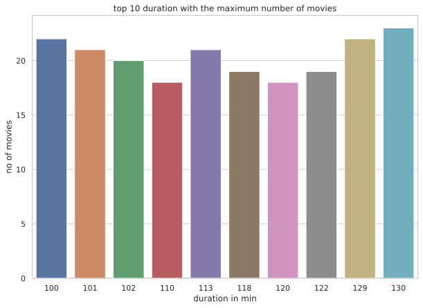
    


## histogram of duration in min


    
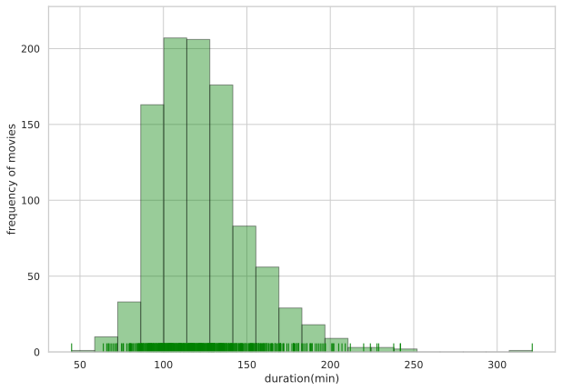
    


```python
sns.distplot(df_imdb['duration(min)'], hist=False, rug=True);
```

  


    
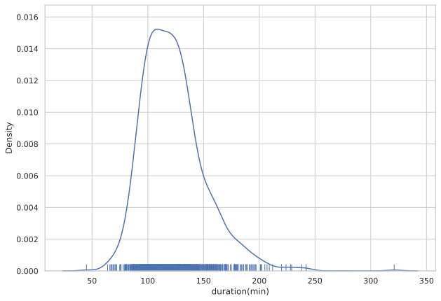
    


```python

```

## TOP TEN MOVIES WITH MAXIMUM DURATION 


```
```


<div>

<table border="1" class="dataframe">
  <thead>
    <tr style="text-align: right;">
      <th></th>
      <th>movie-name</th>
      <th>year</th>
      <th>duration(min)</th>
      <th>genre</th>
      <th>rating</th>
      <th>overview</th>
      <th>director</th>
      <th>image_url</th>
      <th>votes</th>
    </tr>
  </thead>
  <tbody>
    <tr>
      <th>146</th>
      <td>Gangs of Wasseypur</td>
      <td>2012</td>
      <td>321</td>
      <td>Action, Crime, Drama</td>
      <td>8.2</td>
      <td>A clash between Sultan and Shahid Khan leads t...</td>
      <td>Anurag Kashyap</td>
      <td>https://m.media-amazon.com/images/S/sash/4Fyxw...</td>
      <td>87729</td>
    </tr>
    <tr>
      <th>826</th>
      <td>Hamlet</td>
      <td>1996</td>
      <td>242</td>
      <td>Drama</td>
      <td>7.7</td>
      <td>Hamlet, Prince of Denmark, returns home to fin...</td>
      <td>Kenneth Branagh</td>
      <td>https://m.media-amazon.com/images/S/sash/4Fyxw...</td>
      <td>36744</td>
    </tr>
    <tr>
      <th>229</th>
      <td>Zack Snyder's Justice League</td>
      <td>2021</td>
      <td>242</td>
      <td>Action, Adventure, Fantasy</td>
      <td>8.1</td>
      <td>Determined to ensure Superman's ultimate sacri...</td>
      <td>Zack Snyder</td>
      <td>https://m.media-amazon.com/images/S/sash/4Fyxw...</td>
      <td>318072</td>
    </tr>
    <tr>
      <th>327</th>
      <td>Gone with the Wind</td>
      <td>1939</td>
      <td>238</td>
      <td>Drama, History, Romance</td>
      <td>8.1</td>
      <td>A manipulative woman and a roguish man conduct...</td>
      <td>Victor Fleming</td>
      <td>https://m.media-amazon.com/images/S/sash/4Fyxw...</td>
      <td>298516</td>
    </tr>
    <tr>
      <th>76</th>
      <td>Once Upon a Time in America</td>
      <td>1984</td>
      <td>229</td>
      <td>Crime, Drama</td>
      <td>8.4</td>
      <td>A former Prohibition-era Jewish gangster retur...</td>
      <td>Sergio Leone</td>
      <td>https://m.media-amazon.com/images/S/sash/4Fyxw...</td>
      <td>323390</td>
    </tr>
    <tr>
      <th>122</th>
      <td>Lawrence of Arabia</td>
      <td>1962</td>
      <td>228</td>
      <td>Adventure, Biography, Drama</td>
      <td>8.3</td>
      <td>The story of T.E. Lawrence, the English office...</td>
      <td>David Lean</td>
      <td>https://m.media-amazon.com/images/S/sash/4Fyxw...</td>
      <td>276370</td>
    </tr>
    <tr>
      <th>253</th>
      <td>Lagaan: Once Upon a Time in India</td>
      <td>2001</td>
      <td>224</td>
      <td>Drama, Musical, Sport</td>
      <td>8.1</td>
      <td>The people of a small village in Victorian Ind...</td>
      <td>Ashutosh Gowariker</td>
      <td>https://m.media-amazon.com/images/S/sash/4Fyxw...</td>
      <td>108042</td>
    </tr>
    <tr>
      <th>566</th>
      <td>The Ten Commandments</td>
      <td>1956</td>
      <td>220</td>
      <td>Adventure, Drama</td>
      <td>7.9</td>
      <td>Moses, an Egyptian Prince, learns of his true ...</td>
      <td>Cecil B. DeMille</td>
      <td>https://m.media-amazon.com/images/S/sash/4Fyxw...</td>
      <td>66458</td>
    </tr>
    <tr>
      <th>309</th>
      <td>Ben-Hur</td>
      <td>1959</td>
      <td>212</td>
      <td>Adventure, Drama, History</td>
      <td>8.1</td>
      <td>After a Jewish prince is betrayed and sent int...</td>
      <td>William Wyler</td>
      <td>https://m.media-amazon.com/images/S/sash/4Fyxw...</td>
      <td>226191</td>
    </tr>
    <tr>
      <th>618</th>
      <td>The Irishman</td>
      <td>2019</td>
      <td>209</td>
      <td>Biography, Crime, Drama</td>
      <td>7.8</td>
      <td>Hitman Frank Sheeran looks back at the secrets...</td>
      <td>Martin Scorsese</td>
      <td>https://m.media-amazon.com/images/S/sash/4Fyxw...</td>
      <td>345053</td>
    </tr>
  </tbody>
</table>
</div>


## movie with max duration


```python
```


<div>

<table border="1" class="dataframe">
  <thead>
    <tr style="text-align: right;">
      <th></th>
      <th>movie-name</th>
      <th>year</th>
      <th>duration(min)</th>
      <th>genre</th>
      <th>rating</th>
      <th>director</th>
      <th>votes</th>
    </tr>
  </thead>
  <tbody>
    <tr>
      <th>146</th>
      <td>Gangs of Wasseypur</td>
      <td>2012</td>
      <td>321</td>
      <td>Action, Crime, Drama</td>
      <td>8.2</td>
      <td>Anurag Kashyap</td>
      <td>87729</td>
    </tr>
  </tbody>
</table>
</div>


<br>


## top ten movie with highest time 


<br>

    
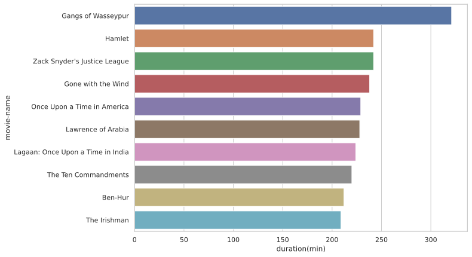
    


## TEN MOVIES WITH LEAST DURATION 


<div>

<table border="1" class="dataframe">
  <thead>
    <tr style="text-align: right;">
      <th></th>
      <th>movie-name</th>
      <th>year</th>
      <th>duration(min)</th>
      <th>genre</th>
      <th>rating</th>
      <th>director</th>
      <th>votes</th>
    </tr>
  </thead>
  <tbody>
    <tr>
      <th>198</th>
      <td>Sherlock Jr.</td>
      <td>1924</td>
      <td>45</td>
      <td>Action, Comedy, Romance</td>
      <td>8.2</td>
      <td>Buster Keaton</td>
      <td>44584</td>
    </tr>
    <tr>
      <th>580</th>
      <td>Freaks</td>
      <td>1932</td>
      <td>64</td>
      <td>Drama, Horror</td>
      <td>7.9</td>
      <td>Tod Browning</td>
      <td>43320</td>
    </tr>
    <tr>
      <th>474</th>
      <td>Battleship Potemkin</td>
      <td>1925</td>
      <td>66</td>
      <td>Drama, History, Thriller</td>
      <td>8.0</td>
      <td>Sergei M. Eisenstein</td>
      <td>54736</td>
    </tr>
    <tr>
      <th>335</th>
      <td>The Cabinet of Dr. Caligari</td>
      <td>1920</td>
      <td>67</td>
      <td>Fantasy, Horror, Mystery</td>
      <td>8.1</td>
      <td>Robert Wiene</td>
      <td>59336</td>
    </tr>
    <tr>
      <th>334</th>
      <td>The General</td>
      <td>1926</td>
      <td>67</td>
      <td>Action, Adventure, Comedy</td>
      <td>8.1</td>
      <td>Clyde Bruckman</td>
      <td>85200</td>
    </tr>
    <tr>
      <th>133</th>
      <td>The Kid</td>
      <td>1921</td>
      <td>68</td>
      <td>Comedy, Drama, Family</td>
      <td>8.3</td>
      <td>Charles Chaplin</td>
      <td>117964</td>
    </tr>
    <tr>
      <th>725</th>
      <td>Duck Soup</td>
      <td>1933</td>
      <td>69</td>
      <td>Comedy, Musical, War</td>
      <td>7.8</td>
      <td>Leo McCarey</td>
      <td>58102</td>
    </tr>
    <tr>
      <th>727</th>
      <td>Frankenstein</td>
      <td>1931</td>
      <td>70</td>
      <td>Drama, Horror, Sci-Fi</td>
      <td>7.8</td>
      <td>James Whale</td>
      <td>67329</td>
    </tr>
    <tr>
      <th>891</th>
      <td>The Invisible Man</td>
      <td>1933</td>
      <td>71</td>
      <td>Horror, Sci-Fi</td>
      <td>7.7</td>
      <td>James Whale</td>
      <td>31912</td>
    </tr>
    <tr>
      <th>332</th>
      <td>The Circus</td>
      <td>1928</td>
      <td>72</td>
      <td>Comedy, Romance</td>
      <td>8.1</td>
      <td>Charles Chaplin</td>
      <td>31435</td>
    </tr>
  </tbody>
</table>
</div>


<br>


## Min duration movie

<br>


<div>

<table border="1" class="dataframe">
  <thead>
    <tr style="text-align: right;">
      <th></th>
      <th>movie-name</th>
      <th>year</th>
      <th>duration(min)</th>
      <th>genre</th>
      <th>rating</th>
      <th>director</th>
      <th>votes</th>
    </tr>
  </thead>
  <tbody>
    <tr>
      <th>198</th>
      <td>Sherlock Jr.</td>
      <td>1924</td>
      <td>45</td>
      <td>Action, Comedy, Romance</td>
      <td>8.2</td>
      <td>Buster Keaton</td>
      <td>44584</td>
    </tr>
  </tbody>
</table>
</div>


```python
```


    
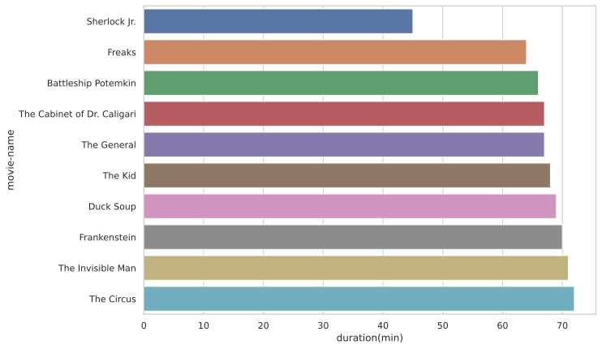
    


## INSIGTHS FROM ANALYSING DURATION COLUMN

- Total 24 movies are there having duartion of 130 minutes.

- Most of the movies have duartion ranging from 113 minutes to 130 minutes.

- Average duration in first 50 movies starting from 1920 to 1944  is 116 min.
- Average duration in last 200 movies starting from 2016 to 2021  is 129 min.
 
- Gangs of Wasseypur has the maximum duration of 321 minutes released in 2012
and Sherlock Jr. Is the movie having the minimum duration of 45 minutes.

<br><br><br>

# ANALYSIS BASED ON GENRES


## number of movies with specific genre


```python
```


<div>

<table border="1" class="dataframe">
  <thead>
    <tr style="text-align: right;">
      <th></th>
      <th>genre</th>
      <th>count</th>
    </tr>
  </thead>
  <tbody>
    <tr>
      <th>0</th>
      <td>Drama</td>
      <td>89</td>
    </tr>
    <tr>
      <th>1</th>
      <td>Comedy, Drama</td>
      <td>36</td>
    </tr>
    <tr>
      <th>2</th>
      <td>Drama, Romance</td>
      <td>35</td>
    </tr>
    <tr>
      <th>3</th>
      <td>Comedy, Drama, Romance</td>
      <td>31</td>
    </tr>
    <tr>
      <th>4</th>
      <td>Crime, Drama, Thriller</td>
      <td>30</td>
    </tr>
    <tr>
      <th>5</th>
      <td>Action, Crime, Drama</td>
      <td>29</td>
    </tr>
    <tr>
      <th>6</th>
      <td>Crime, Drama, Mystery</td>
      <td>29</td>
    </tr>
    <tr>
      <th>7</th>
      <td>Biography, Drama, History</td>
      <td>28</td>
    </tr>
    <tr>
      <th>8</th>
      <td>Crime, Drama</td>
      <td>26</td>
    </tr>
    <tr>
      <th>9</th>
      <td>Animation, Adventure, Comedy</td>
      <td>26</td>
    </tr>
    <tr>
      <th>10</th>
      <td>Action, Adventure, Sci-Fi</td>
      <td>21</td>
    </tr>
    <tr>
      <th>11</th>
      <td>Drama, War</td>
      <td>16</td>
    </tr>
    <tr>
      <th>12</th>
      <td>Comedy, Crime, Drama</td>
      <td>15</td>
    </tr>
    <tr>
      <th>13</th>
      <td>Biography, Crime, Drama</td>
      <td>14</td>
    </tr>
    <tr>
      <th>14</th>
      <td>Animation, Action, Adventure</td>
      <td>13</td>
    </tr>
    <tr>
      <th>15</th>
      <td>Drama, Thriller</td>
      <td>13</td>
    </tr>
    <tr>
      <th>16</th>
      <td>Action, Adventure, Drama</td>
      <td>13</td>
    </tr>
    <tr>
      <th>17</th>
      <td>Comedy</td>
      <td>13</td>
    </tr>
    <tr>
      <th>18</th>
      <td>Biography, Drama</td>
      <td>12</td>
    </tr>
    <tr>
      <th>19</th>
      <td>Action, Adventure, Comedy</td>
      <td>10</td>
    </tr>
  </tbody>
</table>
</div>


    GENRE vs NUMBER OF MOVIES


    
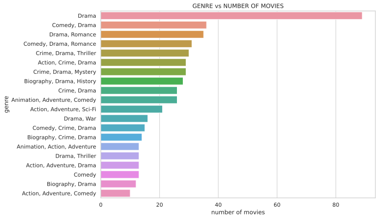
    


## analysis for movies with genre DRAMA only


    Number of movies with Drama = 723


## number of movies in a year having genre  DRAMA 

<br><br>


<div>

<table border="1" class="dataframe">
  <thead>
    <tr style="text-align: right;">
      <th></th>
      <th>yr</th>
      <th>count</th>
    </tr>
  </thead>
  <tbody>
    <tr>
      <th>0</th>
      <td>2013</td>
      <td>25</td>
    </tr>
    <tr>
      <th>1</th>
      <td>2004</td>
      <td>24</td>
    </tr>
    <tr>
      <th>2</th>
      <td>2006</td>
      <td>23</td>
    </tr>
    <tr>
      <th>3</th>
      <td>2016</td>
      <td>22</td>
    </tr>
    <tr>
      <th>4</th>
      <td>2007</td>
      <td>22</td>
    </tr>
  </tbody>
</table>
</div>

<br>
<br><br>
    


## Ten years with the most number of movies having genre as drama

<br><br>


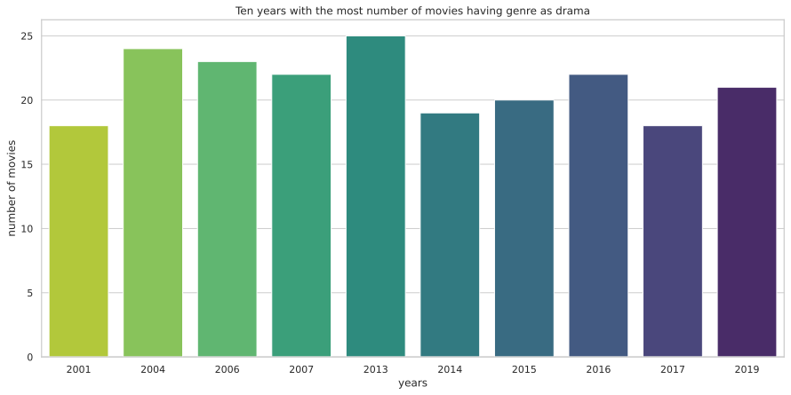
    


## Insights from genre
- Total number of movies with genre DRAMA is 723 , with most number of movies in 2004.


```python

```

# RATING ANALYSIS


## movies with rating greater than equal 9.0


```python
```


<div>

<table border="1" class="dataframe">
  <thead>
    <tr style="text-align: right;">
      <th></th>
      <th>movie-name</th>
      <th>year</th>
      <th>duration(min)</th>
      <th>genre</th>
      <th>rating</th>
      <th>director</th>
      <th>votes</th>
    </tr>
  </thead>
  <tbody>
    <tr>
      <th>0</th>
      <td>The Shawshank Redemption</td>
      <td>1994</td>
      <td>142</td>
      <td>Drama</td>
      <td>9.3</td>
      <td>Frank Darabont</td>
      <td>2429850</td>
    </tr>
    <tr>
      <th>1</th>
      <td>The Godfather</td>
      <td>1972</td>
      <td>175</td>
      <td>Crime, Drama</td>
      <td>9.2</td>
      <td>Francis Ford Coppola</td>
      <td>1682074</td>
    </tr>
    <tr>
      <th>2</th>
      <td>Soorarai Pottru</td>
      <td>2020</td>
      <td>153</td>
      <td>Drama</td>
      <td>9.1</td>
      <td>Sudha Kongara</td>
      <td>85875</td>
    </tr>
    <tr>
      <th>3</th>
      <td>The Dark Knight</td>
      <td>2008</td>
      <td>152</td>
      <td>Action, Crime, Drama</td>
      <td>9.0</td>
      <td>Christopher Nolan</td>
      <td>2385740</td>
    </tr>
    <tr>
      <th>4</th>
      <td>The Godfather: Part II</td>
      <td>1974</td>
      <td>202</td>
      <td>Crime, Drama</td>
      <td>9.0</td>
      <td>Francis Ford Coppola</td>
      <td>1167567</td>
    </tr>
    <tr>
      <th>5</th>
      <td>12 Angry Men</td>
      <td>1957</td>
      <td>96</td>
      <td>Crime, Drama</td>
      <td>9.0</td>
      <td>Sidney Lumet</td>
      <td>717295</td>
    </tr>
  </tbody>
</table>
</div>


```python
```

    Number of movies with rating greater than or equal to 9 :  6


```python


```


## movies with rating greater than or equal to 9


    
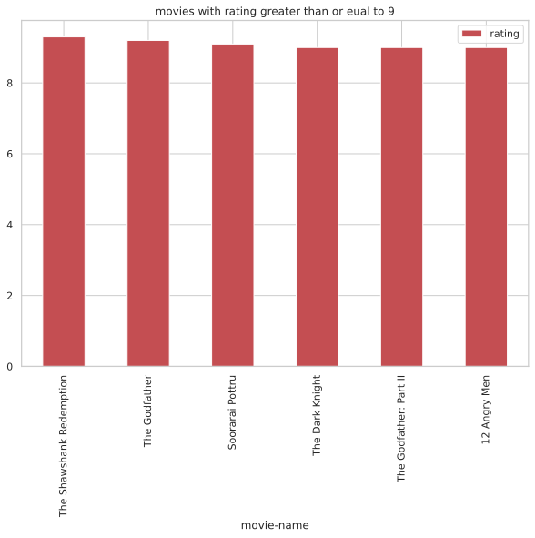
    


## Movie with maximum rating


<div>

<table border="1" class="dataframe">
  <thead>
    <tr style="text-align: right;">
      <th></th>
      <th>movie-name</th>
      <th>year</th>
      <th>duration(min)</th>
      <th>genre</th>
      <th>rating</th>
      <th>director</th>
      <th>votes</th>
    </tr>
  </thead>
  <tbody>
    <tr>
      <th>0</th>
      <td>The Shawshank Redemption</td>
      <td>1994</td>
      <td>142</td>
      <td>Drama</td>
      <td>9.3</td>
      <td>Frank Darabont</td>
      <td>2429850</td>
    </tr>
  </tbody>
</table>
</div>


    
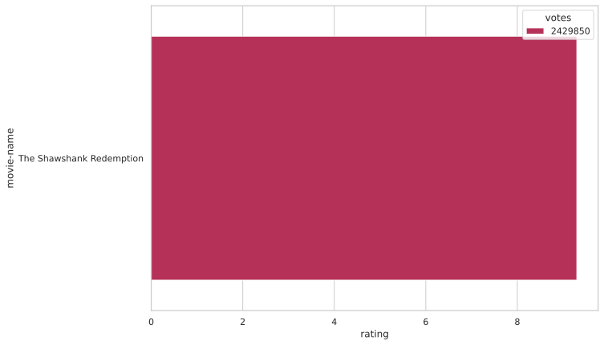
    


## Movie with least rating

```python

```


<div>

<table border="1" class="dataframe">
  <thead>
    <tr style="text-align: right;">
      <th></th>
      <th>movie-name</th>
      <th>year</th>
      <th>duration(min)</th>
      <th>genre</th>
      <th>rating</th>
      <th>director</th>
      <th>votes</th>
    </tr>
  </thead>
  <tbody>
    <tr>
      <th>892</th>
      <td>Dark Waters</td>
      <td>2019</td>
      <td>126</td>
      <td>Biography, Drama, History</td>
      <td>7.6</td>
      <td>Todd Haynes</td>
      <td>70337</td>
    </tr>
    <tr>
      <th>893</th>
      <td>Searching</td>
      <td>2018</td>
      <td>102</td>
      <td>Drama, Mystery, Thriller</td>
      <td>7.6</td>
      <td>Aneesh Chaganty</td>
      <td>148715</td>
    </tr>
    <tr>
      <th>894</th>
      <td>Once Upon a Time... In Hollywood</td>
      <td>2019</td>
      <td>161</td>
      <td>Comedy, Drama</td>
      <td>7.6</td>
      <td>Quentin Tarantino</td>
      <td>611066</td>
    </tr>
    <tr>
      <th>895</th>
      <td>Loveless</td>
      <td>2017</td>
      <td>127</td>
      <td>Drama</td>
      <td>7.6</td>
      <td>Andrey Zvyagintsev</td>
      <td>31175</td>
    </tr>
    <tr>
      <th>896</th>
      <td>Train to Busan</td>
      <td>2016</td>
      <td>118</td>
      <td>Action, Horror, Thriller</td>
      <td>7.6</td>
      <td>Sang-ho Yeon</td>
      <td>181787</td>
    </tr>
  </tbody>
</table>
</div>


```python

```

    Number of movies with lowest rating of  7.6 :  108


## histograph of rating 


```python
```


    
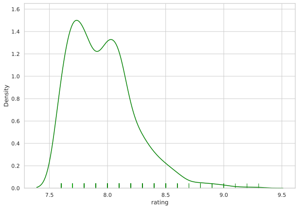
    


```python
```


<div>

<table border="1" class="dataframe">
  <thead>
    <tr style="text-align: right;">
      <th></th>
      <th>rating</th>
      <th>number of movies</th>
    </tr>
  </thead>
  <tbody>
    <tr>
      <th>0</th>
      <td>7.7</td>
      <td>164</td>
    </tr>
    <tr>
      <th>1</th>
      <td>7.8</td>
      <td>146</td>
    </tr>
    <tr>
      <th>2</th>
      <td>8.0</td>
      <td>139</td>
    </tr>
    <tr>
      <th>3</th>
      <td>8.1</td>
      <td>137</td>
    </tr>
    <tr>
      <th>4</th>
      <td>7.6</td>
      <td>108</td>
    </tr>
    <tr>
      <th>5</th>
      <td>7.9</td>
      <td>107</td>
    </tr>
    <tr>
      <th>6</th>
      <td>8.2</td>
      <td>65</td>
    </tr>
    <tr>
      <th>7</th>
      <td>8.3</td>
      <td>47</td>
    </tr>
    <tr>
      <th>8</th>
      <td>8.4</td>
      <td>31</td>
    </tr>
    <tr>
      <th>9</th>
      <td>8.5</td>
      <td>22</td>
    </tr>
  </tbody>
</table>
</div>


```python
```


                      number of movie vs rating 


    
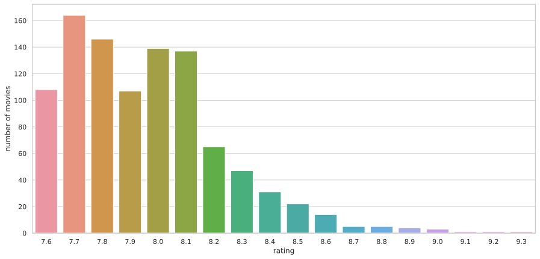
    


## Insights from rating column

<br>

- The movie with maximum rating of 9.3 is The Shawshank Redemption released in 1994
- Number of movies with rating  greater than or equal to 9 is 6.
- Most of the movie were rated in the range of 7.6 to 8.3.
- A total of 164 movie are having 7.7 rating 
- 108 are having the lowest rating of 7.6

<br><br><br>

# DIRECTOR ANALYSIS 


## top 5 director with the most number of movies


```python
```


<div>

<table border="1" class="dataframe">
  <thead>
    <tr style="text-align: right;">
      <th></th>
      <th>director</th>
      <th>number of movies</th>
    </tr>
  </thead>
  <tbody>
    <tr>
      <th>0</th>
      <td>Alfred Hitchcock</td>
      <td>14</td>
    </tr>
    <tr>
      <th>1</th>
      <td>Steven Spielberg</td>
      <td>13</td>
    </tr>
    <tr>
      <th>2</th>
      <td>Hayao Miyazaki</td>
      <td>11</td>
    </tr>
    <tr>
      <th>3</th>
      <td>Martin Scorsese</td>
      <td>10</td>
    </tr>
    <tr>
      <th>4</th>
      <td>Akira Kurosawa</td>
      <td>10</td>
    </tr>
  </tbody>
</table>
</div>

<br><br>

## Top ten director with the most number of movies

<br>
    
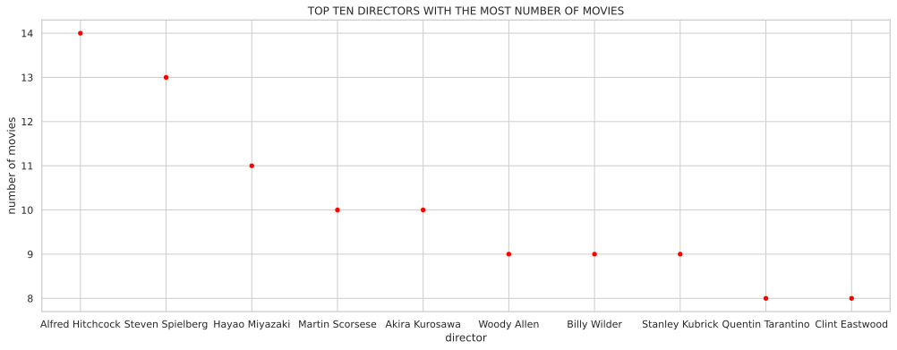
    


## Moives by Director having the highest number of movies


```python
```


<div>

<table border="1" class="dataframe">
  <thead>
    <tr style="text-align: right;">
      <th></th>
      <th>director</th>
      <th>number of movie</th>
    </tr>
  </thead>
  <tbody>
    <tr>
      <th>0</th>
      <td>Alfred Hitchcock</td>
      <td>14</td>
    </tr>
  </tbody>
</table>
</div>


```python
```


    
    
    				MOVIES DIRECTED BY Alfred Hitchcock
    ╒══════════════════════╤════════╤═════════════════╤══════════════════════════════╤══════════╤═════════╕
    │ movie-name           │   year │   duration(min) │ genre                        │   rating │   votes │
    ╞══════════════════════╪════════╪═════════════════╪══════════════════════════════╪══════════╪═════════╡
    │ Psycho               │   1960 │             109 │ Horror, Mystery, Thriller    │      8.5 │  622803 │
    ├──────────────────────┼────────┼─────────────────┼──────────────────────────────┼──────────┼─────────┤
    │ Rear Window          │   1954 │             112 │ Mystery, Thriller            │      8.5 │  459083 │
    ├──────────────────────┼────────┼─────────────────┼──────────────────────────────┼──────────┼─────────┤
    │ North by Northwest   │   1959 │             136 │ Adventure, Mystery, Thriller │      8.3 │  308528 │
    ├──────────────────────┼────────┼─────────────────┼──────────────────────────────┼──────────┼─────────┤
    │ Vertigo              │   1958 │             128 │ Mystery, Romance, Thriller   │      8.3 │  377050 │
    ├──────────────────────┼────────┼─────────────────┼──────────────────────────────┼──────────┼─────────┤
    │ Dial M for Murder    │   1954 │             105 │ Crime, Thriller              │      8.2 │  163988 │
    ├──────────────────────┼────────┼─────────────────┼──────────────────────────────┼──────────┼─────────┤
    │ Rebecca              │   1940 │             130 │ Drama, Mystery, Romance      │      8.1 │  129346 │
    ├──────────────────────┼────────┼─────────────────┼──────────────────────────────┼──────────┼─────────┤
    │ Strangers on a Train │   1951 │             101 │ Crime, Film-Noir, Thriller   │      8   │  127735 │
    ├──────────────────────┼────────┼─────────────────┼──────────────────────────────┼──────────┼─────────┤
    │ Rope                 │   1948 │              80 │ Crime, Drama, Mystery        │      8   │  134125 │
    ├──────────────────────┼────────┼─────────────────┼──────────────────────────────┼──────────┼─────────┤
    │ Notorious            │   1946 │             102 │ Drama, Film-Noir, Romance    │      8   │   96064 │
    ├──────────────────────┼────────┼─────────────────┼──────────────────────────────┼──────────┼─────────┤
    │ Shadow of a Doubt    │   1943 │             108 │ Film-Noir, Thriller          │      7.8 │   61726 │
    ├──────────────────────┼────────┼─────────────────┼──────────────────────────────┼──────────┼─────────┤
    │ The Lady Vanishes    │   1938 │              96 │ Mystery, Thriller            │      7.8 │   49295 │
    ├──────────────────────┼────────┼─────────────────┼──────────────────────────────┼──────────┼─────────┤
    │ The Birds            │   1963 │             119 │ Drama, Horror, Mystery       │      7.7 │  176977 │
    ├──────────────────────┼────────┼─────────────────┼──────────────────────────────┼──────────┼─────────┤
    │ The 39 Steps         │   1935 │              86 │ Crime, Mystery, Thriller     │      7.7 │   53788 │
    ├──────────────────────┼────────┼─────────────────┼──────────────────────────────┼──────────┼─────────┤
    │ Lifeboat             │   1944 │              97 │ Drama, War                   │      7.6 │   27345 │
    ╘══════════════════════╧════════╧═════════════════╧══════════════════════════════╧══════════╧═════════╛


<br><br>

## This is jointplot graph that shows the relation between rating and number of votes


    
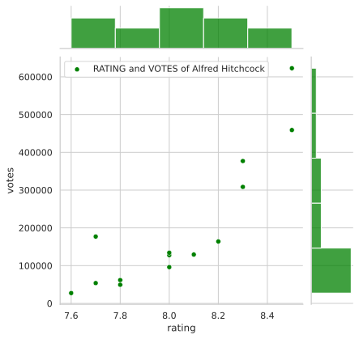
    


```python

```

## Moives by Christopher Nolan


```python
```

    Number of movies Directed by Christopher Nolan :  8


    
    
    				MOVIES DIRECTED BY CHRISTOPHER NOLAN
    ╒═══════════════════════╤════════╤═════════════════╤═══════════════════════════╤══════════╤═════════╕
    │ movie-name            │   year │   duration(min) │ genre                     │   rating │   votes │
    ╞═══════════════════════╪════════╪═════════════════╪═══════════════════════════╪══════════╪═════════╡
    │ The Dark Knight       │   2008 │             152 │ Action, Crime, Drama      │      9   │ 2385740 │
    ├───────────────────────┼────────┼─────────────────┼───────────────────────────┼──────────┼─────────┤
    │ Inception             │   2010 │             148 │ Action, Adventure, Sci-Fi │      8.8 │ 2141317 │
    ├───────────────────────┼────────┼─────────────────┼───────────────────────────┼──────────┼─────────┤
    │ Interstellar          │   2014 │             169 │ Adventure, Drama, Sci-Fi  │      8.6 │ 1586642 │
    ├───────────────────────┼────────┼─────────────────┼───────────────────────────┼──────────┼─────────┤
    │ The Prestige          │   2006 │             130 │ Drama, Mystery, Sci-Fi    │      8.5 │ 1229931 │
    ├───────────────────────┼────────┼─────────────────┼───────────────────────────┼──────────┼─────────┤
    │ The Dark Knight Rises │   2012 │             164 │ Action, Adventure         │      8.4 │ 1560678 │
    ├───────────────────────┼────────┼─────────────────┼───────────────────────────┼──────────┼─────────┤
    │ Memento               │   2000 │             113 │ Mystery, Thriller         │      8.4 │ 1157260 │
    ├───────────────────────┼────────┼─────────────────┼───────────────────────────┼──────────┼─────────┤
    │ Batman Begins         │   2005 │             140 │ Action, Adventure         │      8.2 │ 1345556 │
    ├───────────────────────┼────────┼─────────────────┼───────────────────────────┼──────────┼─────────┤
    │ Dunkirk               │   2017 │             106 │ Action, Drama, History    │      7.8 │  584564 │
    ╘═══════════════════════╧════════╧═════════════════╧═══════════════════════════╧══════════╧═════════╛


## Insights from Director column

<br>

- **Alfred Hitchcock** is the director with most number of movies among all directors.
Total 14 movies were directed by him.

<br>

- Movies by **Christopher Nolan** : 
    - Total number of movies directed : 8
    - Movies with higest rating (9) : The Dark Knight ( 2008 )
    - Movies with highest duration(169 min ) :  Interstellar (2014)

# VOTES ANALYSIS


```python

```

## TOP TEN MOVIES WITH THE HIGHEST NUMBER OF VOTES


```python
```


<div>

<table border="1" class="dataframe">
  <thead>
    <tr style="text-align: right;">
      <th></th>
      <th>movie-name</th>
      <th>year</th>
      <th>duration(min)</th>
      <th>genre</th>
      <th>rating</th>
      <th>overview</th>
      <th>director</th>
      <th>image_url</th>
      <th>votes</th>
    </tr>
  </thead>
  <tbody>
    <tr>
      <th>0</th>
      <td>The Shawshank Redemption</td>
      <td>1994</td>
      <td>142</td>
      <td>Drama</td>
      <td>9.3</td>
      <td>Two imprisoned men bond over a number of years...</td>
      <td>Frank Darabont</td>
      <td>https://m.media-amazon.com/images/M/MV5BMDFkYT...</td>
      <td>2429850</td>
    </tr>
    <tr>
      <th>3</th>
      <td>The Dark Knight</td>
      <td>2008</td>
      <td>152</td>
      <td>Action, Crime, Drama</td>
      <td>9.0</td>
      <td>When the menace known as the Joker wreaks havo...</td>
      <td>Christopher Nolan</td>
      <td>https://m.media-amazon.com/images/M/MV5BMTMxNT...</td>
      <td>2385740</td>
    </tr>
    <tr>
      <th>10</th>
      <td>Inception</td>
      <td>2010</td>
      <td>148</td>
      <td>Action, Adventure, Sci-Fi</td>
      <td>8.8</td>
      <td>A thief who steals corporate secrets through t...</td>
      <td>Christopher Nolan</td>
      <td>https://m.media-amazon.com/images/S/sash/4Fyxw...</td>
      <td>2141317</td>
    </tr>
    <tr>
      <th>11</th>
      <td>Fight Club</td>
      <td>1999</td>
      <td>139</td>
      <td>Drama</td>
      <td>8.8</td>
      <td>An insomniac office worker and a devil-may-car...</td>
      <td>David Fincher</td>
      <td>https://m.media-amazon.com/images/S/sash/4Fyxw...</td>
      <td>1916428</td>
    </tr>
    <tr>
      <th>8</th>
      <td>Pulp Fiction</td>
      <td>1994</td>
      <td>154</td>
      <td>Crime, Drama</td>
      <td>8.9</td>
      <td>The lives of two mob hitmen, a boxer, a gangst...</td>
      <td>Quentin Tarantino</td>
      <td>https://m.media-amazon.com/images/S/sash/4Fyxw...</td>
      <td>1885285</td>
    </tr>
    <tr>
      <th>13</th>
      <td>Forrest Gump</td>
      <td>1994</td>
      <td>142</td>
      <td>Drama, Romance</td>
      <td>8.8</td>
      <td>The presidencies of Kennedy and Johnson, the V...</td>
      <td>Robert Zemeckis</td>
      <td>https://m.media-amazon.com/images/S/sash/4Fyxw...</td>
      <td>1878044</td>
    </tr>
    <tr>
      <th>16</th>
      <td>The Matrix</td>
      <td>1999</td>
      <td>136</td>
      <td>Action, Sci-Fi</td>
      <td>8.7</td>
      <td>When a beautiful stranger leads computer hacke...</td>
      <td>Lana Wachowski</td>
      <td>https://m.media-amazon.com/images/S/sash/4Fyxw...</td>
      <td>1730705</td>
    </tr>
    <tr>
      <th>12</th>
      <td>The Lord of the Rings: The Fellowship of the Ring</td>
      <td>2001</td>
      <td>178</td>
      <td>Action, Adventure, Drama</td>
      <td>8.8</td>
      <td>A meek Hobbit from the Shire and eight compani...</td>
      <td>Peter Jackson</td>
      <td>https://m.media-amazon.com/images/S/sash/4Fyxw...</td>
      <td>1711745</td>
    </tr>
    <tr>
      <th>7</th>
      <td>The Lord of the Rings: The Return of the King</td>
      <td>2003</td>
      <td>201</td>
      <td>Action, Adventure, Drama</td>
      <td>8.9</td>
      <td>Gandalf and Aragorn lead the World of Men agai...</td>
      <td>Peter Jackson</td>
      <td>https://m.media-amazon.com/images/S/sash/4Fyxw...</td>
      <td>1690502</td>
    </tr>
    <tr>
      <th>1</th>
      <td>The Godfather</td>
      <td>1972</td>
      <td>175</td>
      <td>Crime, Drama</td>
      <td>9.2</td>
      <td>An organized crime dynasty's aging patriarch t...</td>
      <td>Francis Ford Coppola</td>
      <td>https://m.media-amazon.com/images/M/MV5BM2MyNj...</td>
      <td>1682074</td>
    </tr>
  </tbody>
</table>
</div>


```python

```


    
    
    					TOP TEN MOVIES WITH THE HIGHEST NUMBER OF VOTES
    ╒═══════════════════════════════════════════════════╤════════╤═════════════════╤══════════╤══════════════════════╤═════════╕
    │ movie-name                                        │   year │   duration(min) │   rating │ director             │   votes │
    ╞═══════════════════════════════════════════════════╪════════╪═════════════════╪══════════╪══════════════════════╪═════════╡
    │ The Shawshank Redemption                          │   1994 │             142 │      9.3 │ Frank Darabont       │ 2429850 │
    ├───────────────────────────────────────────────────┼────────┼─────────────────┼──────────┼──────────────────────┼─────────┤
    │ The Dark Knight                                   │   2008 │             152 │      9   │ Christopher Nolan    │ 2385740 │
    ├───────────────────────────────────────────────────┼────────┼─────────────────┼──────────┼──────────────────────┼─────────┤
    │ Inception                                         │   2010 │             148 │      8.8 │ Christopher Nolan    │ 2141317 │
    ├───────────────────────────────────────────────────┼────────┼─────────────────┼──────────┼──────────────────────┼─────────┤
    │ Fight Club                                        │   1999 │             139 │      8.8 │ David Fincher        │ 1916428 │
    ├───────────────────────────────────────────────────┼────────┼─────────────────┼──────────┼──────────────────────┼─────────┤
    │ Pulp Fiction                                      │   1994 │             154 │      8.9 │ Quentin Tarantino    │ 1885285 │
    ├───────────────────────────────────────────────────┼────────┼─────────────────┼──────────┼──────────────────────┼─────────┤
    │ Forrest Gump                                      │   1994 │             142 │      8.8 │ Robert Zemeckis      │ 1878044 │
    ├───────────────────────────────────────────────────┼────────┼─────────────────┼──────────┼──────────────────────┼─────────┤
    │ The Matrix                                        │   1999 │             136 │      8.7 │ Lana Wachowski       │ 1730705 │
    ├───────────────────────────────────────────────────┼────────┼─────────────────┼──────────┼──────────────────────┼─────────┤
    │ The Lord of the Rings: The Fellowship of the Ring │   2001 │             178 │      8.8 │ Peter Jackson        │ 1711745 │
    ├───────────────────────────────────────────────────┼────────┼─────────────────┼──────────┼──────────────────────┼─────────┤
    │ The Lord of the Rings: The Return of the King     │   2003 │             201 │      8.9 │ Peter Jackson        │ 1690502 │
    ├───────────────────────────────────────────────────┼────────┼─────────────────┼──────────┼──────────────────────┼─────────┤
    │ The Godfather                                     │   1972 │             175 │      9.2 │ Francis Ford Coppola │ 1682074 │
    ╘═══════════════════════════════════════════════════╧════════╧═════════════════╧══════════╧══════════════════════╧═════════╛


## movie with highest votes


```python
```


<div>

<table border="1" class="dataframe">
  <thead>
    <tr style="text-align: right;">
      <th></th>
      <th>movie-name</th>
      <th>year</th>
      <th>duration(min)</th>
      <th>genre</th>
      <th>rating</th>
      <th>director</th>
      <th>votes</th>
    </tr>
  </thead>
  <tbody>
    <tr>
      <th>0</th>
      <td>The Shawshank Redemption</td>
      <td>1994</td>
      <td>142</td>
      <td>Drama</td>
      <td>9.3</td>
      <td>Frank Darabont</td>
      <td>2429850</td>
    </tr>
  </tbody>
</table>
</div>


## Movies with the lowest votes


```python
```


<div>

<table border="1" class="dataframe">
  <thead>
    <tr style="text-align: right;">
      <th></th>
      <th>movie-name</th>
      <th>year</th>
      <th>duration(min)</th>
      <th>genre</th>
      <th>rating</th>
      <th>director</th>
      <th>votes</th>
    </tr>
  </thead>
  <tbody>
    <tr>
      <th>478</th>
      <td>Hindi Medium</td>
      <td>2017</td>
      <td>132</td>
      <td>Comedy, Drama</td>
      <td>7.9</td>
      <td>Saket Chaudhary</td>
      <td>25174</td>
    </tr>
  </tbody>
</table>
</div>


```python

```


    
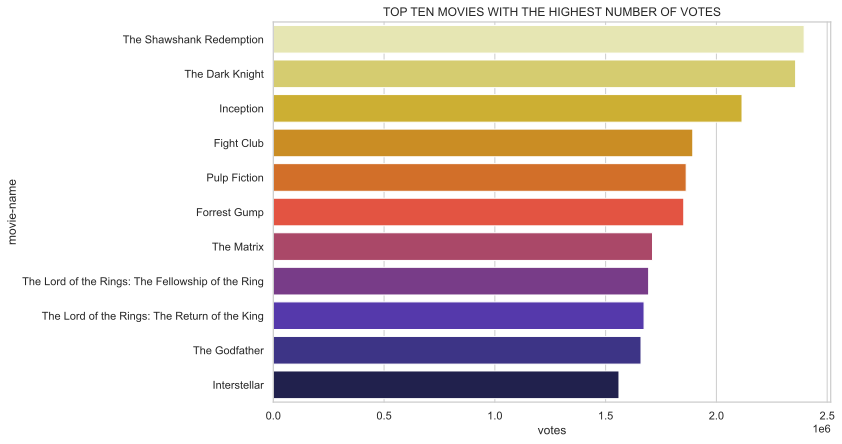
    


```python
```


<div>

<table border="1" class="dataframe">
  <thead>
    <tr style="text-align: right;">
      <th></th>
      <th>movie-name</th>
      <th>year</th>
      <th>duration(min)</th>
      <th>genre</th>
      <th>rating</th>
      <th>director</th>
      <th>votes</th>
    </tr>
  </thead>
  <tbody>
    <tr>
      <th>0</th>
      <td>The Shawshank Redemption</td>
      <td>1994</td>
      <td>142</td>
      <td>Drama</td>
      <td>9.3</td>
      <td>Frank Darabont</td>
      <td>2429850</td>
    </tr>
    <tr>
      <th>3</th>
      <td>The Dark Knight</td>
      <td>2008</td>
      <td>152</td>
      <td>Action, Crime, Drama</td>
      <td>9.0</td>
      <td>Christopher Nolan</td>
      <td>2385740</td>
    </tr>
    <tr>
      <th>10</th>
      <td>Inception</td>
      <td>2010</td>
      <td>148</td>
      <td>Action, Adventure, Sci-Fi</td>
      <td>8.8</td>
      <td>Christopher Nolan</td>
      <td>2141317</td>
    </tr>
    <tr>
      <th>11</th>
      <td>Fight Club</td>
      <td>1999</td>
      <td>139</td>
      <td>Drama</td>
      <td>8.8</td>
      <td>David Fincher</td>
      <td>1916428</td>
    </tr>
    <tr>
      <th>8</th>
      <td>Pulp Fiction</td>
      <td>1994</td>
      <td>154</td>
      <td>Crime, Drama</td>
      <td>8.9</td>
      <td>Quentin Tarantino</td>
      <td>1885285</td>
    </tr>
    <tr>
      <th>13</th>
      <td>Forrest Gump</td>
      <td>1994</td>
      <td>142</td>
      <td>Drama, Romance</td>
      <td>8.8</td>
      <td>Robert Zemeckis</td>
      <td>1878044</td>
    </tr>
    <tr>
      <th>16</th>
      <td>The Matrix</td>
      <td>1999</td>
      <td>136</td>
      <td>Action, Sci-Fi</td>
      <td>8.7</td>
      <td>Lana Wachowski</td>
      <td>1730705</td>
    </tr>
    <tr>
      <th>12</th>
      <td>The Lord of the Rings: The Fellowship of the Ring</td>
      <td>2001</td>
      <td>178</td>
      <td>Action, Adventure, Drama</td>
      <td>8.8</td>
      <td>Peter Jackson</td>
      <td>1711745</td>
    </tr>
    <tr>
      <th>7</th>
      <td>The Lord of the Rings: The Return of the King</td>
      <td>2003</td>
      <td>201</td>
      <td>Action, Adventure, Drama</td>
      <td>8.9</td>
      <td>Peter Jackson</td>
      <td>1690502</td>
    </tr>
    <tr>
      <th>1</th>
      <td>The Godfather</td>
      <td>1972</td>
      <td>175</td>
      <td>Crime, Drama</td>
      <td>9.2</td>
      <td>Francis Ford Coppola</td>
      <td>1682074</td>
    </tr>
  </tbody>
</table>
</div>


## top ten movies with highest rating and votes


```python
```

## This jointplot graph shows the relation between rating and number of votes of the top ten movies with the highest number of votes.

<br>


    
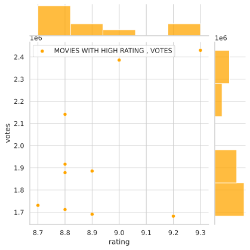
    
<br>
<br>

## Insights from the votes column

<br>

- Movie with highest votes  ( 2429850 votes) :  The Shawshank Redemption.

- Movie with lowest number of votes : ( 25274 votes ) : Hindi Medium.

- From the jointplot graph above it is clear that the movies with highest rating is not having the highest votes .

- The reason behind may be because the most voted movies are released in the most recent so with the involvement of science and technolgy people are more interact with the cinema world and another may be the population which increases with time.

- Taking a example the movie " **The God Father** " released in 1972 is having  a rating of 9.2  has less number of votes than the movie " **inception** " ( 2010 ) which has a rating of 8.8.

